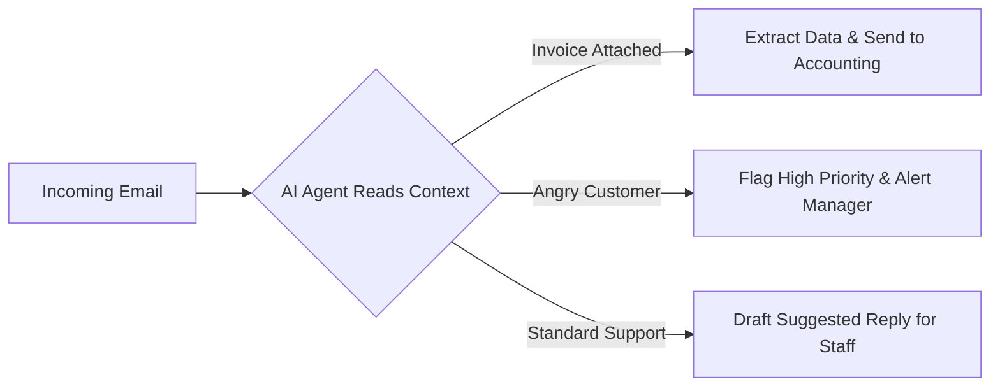

If you are a director, founder, or manager, you don't care about API endpoints, webhook payloads, or how an LLM is trained. You care about output. You want your team doing high-value work, not clicking buttons in a spreadsheet.

When we consult with businesses at [White Space Designs](https://whitespacedesign.ca), they often think automation requires a six-month IT overhaul. It doesn't. 

Here are three high-impact, "quick win" automations you can deploy in a matter of days that instantly look brilliant on a quarterly report.

---

## 1. The "Zero-Leak" Lead Capture
**The Problem:** A potential client fills out a contact form on your website at 8:00 PM. The email sits in a generic `info@` inbox until 9:30 AM the next day. By the time your sales team replies, the lead has already bought from a competitor.
**The Automation:**
When the form is submitted, the automation instantly:
1. Pushes the lead's exact details into your CRM (Salesforce, HubSpot, etc.).
2. Sends an immediate, personalized text message or email to the prospect acknowledging them by name.
3. Pings your sales team in a dedicated Slack/Teams channel with a button to "Claim Lead."

**The Boss's ROI:** You stop bleeding warm leads to competitors. Speed-to-lead drops from 14 hours to 14 seconds.

---

## 2. Smart Email Triage (The Inbox Defender)
**The Problem:** Your customer service or operations team spends their first two hours every morning just sorting emails. ("This is a refund request," "This is a vendor invoice," "This is spam.")
**The Automation:**
Instead of humans reading the inbox, an AI agent acts as a traffic cop.

**The Boss's ROI:** Your staff logs in and starts *solving problems* instead of *sorting them*. High-priority fires are put out faster, and payroll isn't wasted on inbox management.

---

## 3. The "Hands-Free" Invoice Parser
**The Problem:** Vendors email you PDF invoices. Someone on your accounts payable team opens the PDF, reads the total, and manually types it into QuickBooks. It's slow, boring, and prone to typos.
**The Automation:**
Every time an email with the word "Invoice" arrives, the AI automatically strips the PDF, reads the Total Amount, the Vendor Name, and the PO Number, and pushes it directly into your accounting software as a "Draft Bill" awaiting one-click approval.

**The Boss's ROI:** You eliminate data entry errors and buy back hundreds of hours a year for your accounting department.

---

### The Bottom Line
You don't need to know how to code to understand good business logic. The best automations are invisible; they just make the business run smoother, faster, and cheaper.

*Want to stop talking about automation and actually deploy it? Reach out to my team at [joshbyberg.com](https://joshbyberg.com) and we'll build the system for you.*
